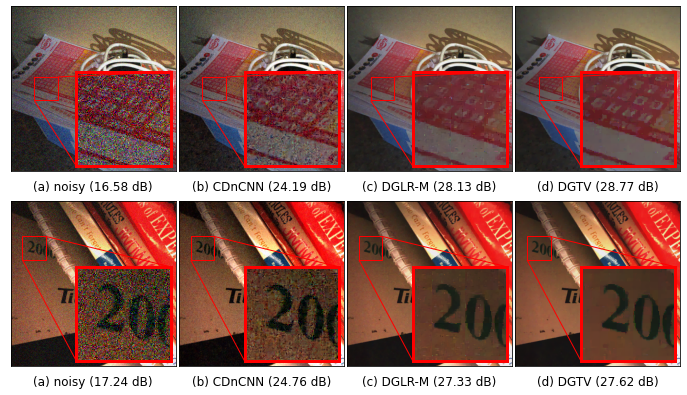

Paper: [Unrolling of Deep Graph Total Variation for Image Denoising](https://arxiv.org/abs/2010.11290)

GitHub: [huyvd7/deepgtv](https://github.com/huyvd7/deepgtv)
<p align="center">
  
<p align="center"><b>Fig.</b> Trained and tested on different noise distributions.</p>
</p>

# Dataset descriptions
See [Dataset](https://github.com/huyvd7/deepgtv/blob/master/dataset/README.md)

# Train DGTV
```python
python train_dgtv.py --batch 32 --lr 1e-4 --umin 0.001 --umax 1000 -m model/DGTV.pkl --epoch 50 --train TRAINSET_PATH --width 36 
```

Note:
- width: square patch size 

# Test DGTV
```python
python test_dgtv.py -w 720 -m MODEL_NAME --stride 9 --multi 500 -p TESTSET_PATH
```

Note:
- stride: # of pixels moved between two patches
- multi: # of patches to be processed simultaneously

# TODO
- [ ] Denoise a given single image

</div>
